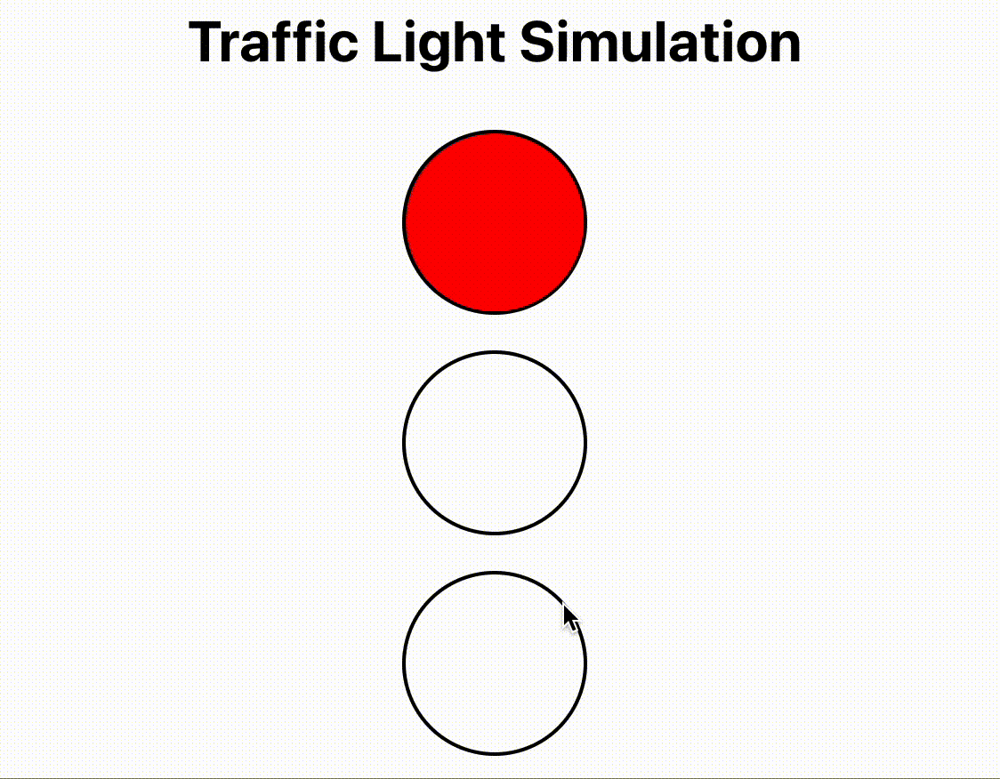

# Traffic Lights

## Overview 
A traffic light app where the lights switch from green to yellow to red after predetermined intervals
and loop indefinitely. Each light should be lit for the following durations:
Red light: 4000ms
Yellow light: 500ms
Green light: 3000ms

## Getting Started

To run this project locally, follow these steps:

1. Clone the repository to your local machine:
   - `git clone https://github.com/abhisheknairSDE/TrafficLights.git`

2. Navigate to the project directory:
   - `cd traffic-lights`

3. Install the project dependencies using npm:
   - `npm install`

4. Start the app:
   - `npm start`

## Usage
The traffic light simulation automatically cycles through the colors with the following durations:

Red light: 4 seconds
Yellow light: 0.5 seconds
Green light: 3 seconds
The active light will be highlighted, and the others will be dimmed.